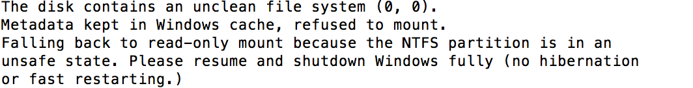

Mac/Linux do not recoganize windows file system. Linux Kernel NTFS driver only supports read-only mounts. For read-write access you need install and use NTFS-3G. NTFS-3G is an open source cross-platform implementation of the Microsoft Windows NTFS file system with read-write support. Following are the steps to mount NTFS file system on MAC OS.

1) Brew install ntfs-3g

2) sudo ntfs-3g /dev/disk2s6 mnt/ntfs

Where /dev/disk2s6 is the location of disk that needs to be mounted and mnt/ntfs is the mount point.

To get location of disk, run the command below.

* diskutil list

I ran into following issue of not properly shut down window as I am using hard drive from my old laptop. 

if above issue appear run the following command:

* sudo ntfsfix /dev/disk2s6
* and re-run command 2

The disk should have been mounted by now. Enjoy!